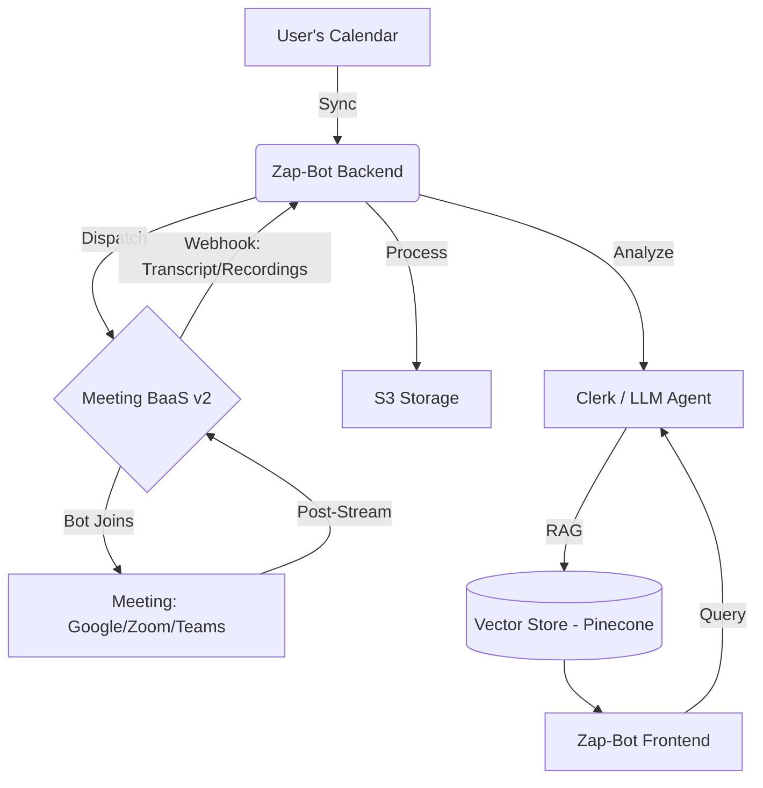

# Zap-Bot: AI-Powered Meeting Intelligence 

Zap-Bot is a premium, enterprise-ready AI meeting assistant that records, transcribes, and analyzes your meetings across **Google Meet**, **Zoom**, and **Microsoft Teams**. It provides deep, actionable insights using state-of-the-art AI, allowing your team to focus on the conversation rather than the notes.


## 🚀 Key Features

- **Real-time Meeting Listening**: Seamlessly join meetings (Google Meet, Zoom, MS Teams) to capture high-fidelity context.
- **PageIndex AI Integration**: Advanced RAG architecture for instant meeting insights across your entire history.
- **Intelligent Calendar Management**: Synchronize with your calendar to automatically prepare and dispatch bots.
- **Premium Design System**: Stunning dashboard using glassmorphism, fluid animations (Framer Motion), and modern aesthetics.
- **Add to Calendar**: One-click integration to sync meetings across Google, Outlook, and Yahoo calendars.
- **Secure Transcription**: Compliant, high-accuracy transcription through Meeting BaaS v2 (Bearer Auth).

## 🏗 System Architecture



## 🛠 Tech Stack

| Layer | Technologies |
| :--- | :--- |
| **Frontend** | Next.js 15, Tailwind CSS, Zustand, Lucide Icons |
| **Backend** | Node.js (Express), Clerk Auth, Prisma (PostgreSQL) |
| **Integrations** | MeetingBaas v2 (Bot-as-a-Service), PageIndex AI API |
| **Infrastructure** | AWS (S3, Lambda), Turborepo, Pinecone |
| **Deployment** | Vercel (Web), Render/AWS (API) |

## 📦 Getting Started

### 1. Prerequisites
- Node.js >= 18
- pnpm

### 2. Installation
```bash
# Clone the repository
git clone https://github.com/your-username/zap-bot.git
cd zap-bot

# Install dependencies
pnpm install
```

### 3. Environment Setup
Configure `.env` files in `apps/api` and `apps/web`.

**Critical Keys:**
- `MEETING_BAAS_API_KEY`: Required for bot dispatch (Starts with `mb-`)
- `NEXT_PUBLIC_API_URL`: Backend API endpoint

### 4. Run Development
```bash
pnpm dev
```

## 🧪 Testing
We use **Vitest** for robust unit testing across the monorepo.
```bash
pnpm test
```

## 🚀 Features Under Development
- [ ] Real-time Chat with Meeting Bot
- [ ] Automated Asana/Jira Task Creation
- [ ] Multi-language Transcription Support

---
**Mission Accomplished: Zap-Bot is ready to redefine your meeting experience.**
