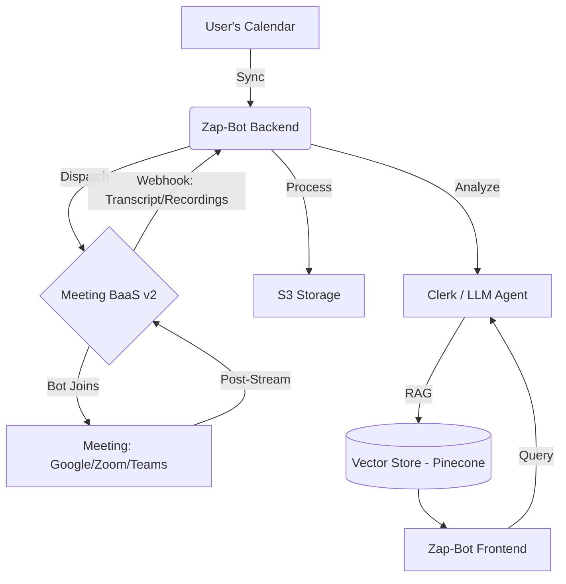

# Zap-Bot: AI-Powered Meeting Intelligence 

Zap-Bot is a premium, enterprise-ready AI meeting assistant that records, transcribes, and analyzes your meetings across **Google Meet**, **Zoom**, and **Microsoft Teams**. It provides deep, actionable insights using state-of-the-art AI, allowing your team to focus on the conversation rather than the notes.


## 🚀 Key Features

- **Real-time Meeting Listening**: Seamlessly join meetings (Google Meet, Zoom, MS Teams) to capture high-fidelity context.
- **PageIndex AI Integration**: Advanced RAG architecture for instant meeting insights across your entire history.
- **Intelligent Calendar Management**: Synchronize with your calendar to automatically prepare and dispatch bots.
- **Premium Design System**: Stunning dashboard using glassmorphism, fluid animations (Framer Motion), and modern aesthetics.
- **Add to Calendar**: One-click integration to sync meetings across Google, Outlook, and Yahoo calendars.
- **Secure Transcription**: Compliant, high-accuracy transcription through Meeting BaaS v2 (Bearer Auth).

## 🏗 System Architecture



## 🛠 Tech Stack

| Layer | Technologies |
| :--- | :--- |
| **Frontend** | Next.js 16, Tailwind CSS, Zustand, Lucide Icons |
| **Backend** | Appwrite (Serverless), Node.js, Clerk Auth |
| **AI/ML** | Groq (Mixtral), LangChain, LangGraph, RAG |
| **Integrations** | MeetingBaas v2 (Bot-as-a-Service), PageIndex AI API |
| **Infrastructure** | Appwrite (Database, Storage, Auth), AWS (S3, Lambda) |
| **Deployment** | Vercel (Web) |

## 📦 Getting Started

### 1. Prerequisites
- Node.js >= 18
- pnpm

### 2. Installation
```bash
# Clone the repository
git clone https://github.com/your-username/zap-bot.git
cd zap-bot

# Install Node.js dependencies
pnpm install
```

### 3. Repository Folder Structure

```text
app/, components/, lib/, public/, ... -> Next.js App Router app at repository root
apps/
    api/   -> Node/Express API service (optional for local/full stack runs)
packages/
    shared/, meeting-baas/, eslint-config/, typescript-config/
```

### 4. Environment Setup
Configure `.env` files.

**Critical Keys:**
- `MEETING_BAAS_API_KEY`: Required for bot dispatch (Starts with `mb-`)
- `APPWRITE_PROJECT_ID`: Your Appwrite project identifier
- `APPWRITE_DATABASE_ID`: Your Appwrite database identifier
- `APPWRITE_API_KEY`: Your Appwrite API key (backend only)
- `NEXT_PUBLIC_APPWRITE_ENDPOINT`: Your Appwrite endpoint URL

### 5. Run Development
```bash
# Next.js app only (recommended)
pnpm dev

# Full monorepo dev (web + api)
pnpm dev:all

# API only (optional)
pnpm dev:api
```

### 6. Access the Application
- **Frontend**: http://localhost:3000
- **Node.js API** (optional): http://localhost:3001

## 🧪 Testing
We use TypeScript checks and package-level tests.

```bash
# Type-check the Next.js app
pnpm check-types

# API tests (if needed)
pnpm --filter api test
```

## 🚀 Deploy (Vercel)

This repo is configured to deploy as a Next.js app from `web` using root-level commands in `vercel.json`.

```bash
pnpm build
```

## 🚀 Features Under Development
- [x] Real-time Chat with Meeting Bot
- [ ] Automated Asana/Jira Task Creation
- [ ] Multi-language Transcription Support

---
**Mission Accomplished: Zap-Bot is ready to redefine your meeting experience.**
