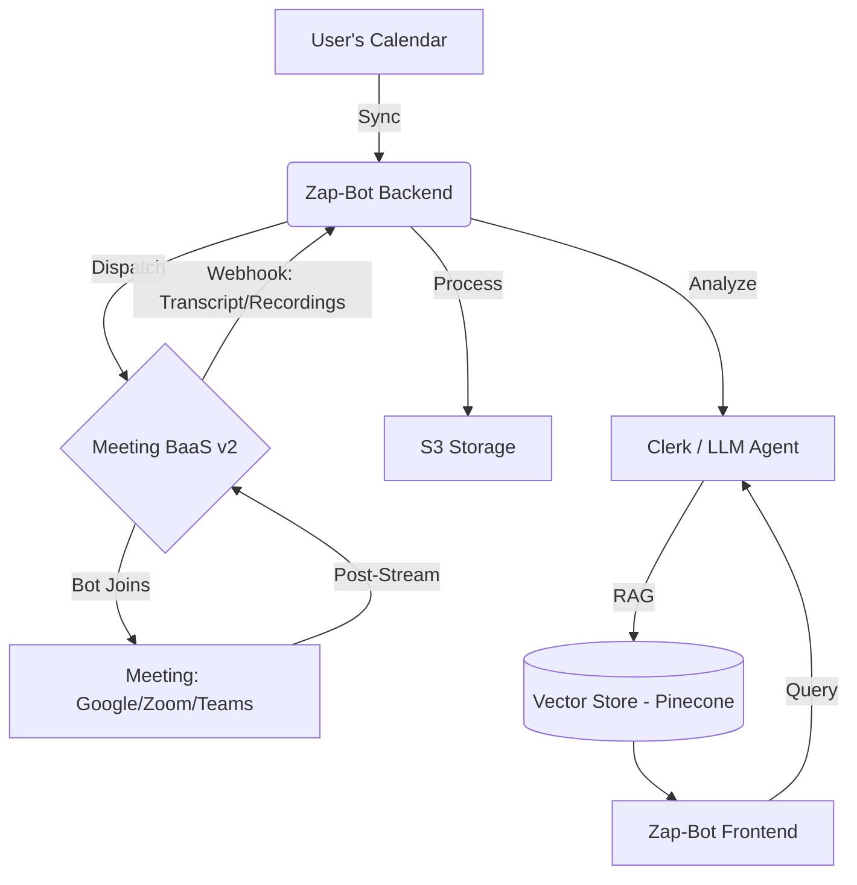

# Zap-Bot: AI-Powered Meeting Intelligence 

Zap-Bot is a premium, enterprise-ready AI meeting assistant that records, transcribes, and analyzes your meetings across **Google Meet**, **Zoom**, and **Microsoft Teams**. It provides deep, actionable insights using state-of-the-art AI, allowing your team to focus on the conversation rather than the notes.


## 🚀 Key Features

- **Real-time Meeting Listening**: Seamlessly join meetings (Google Meet, Zoom, MS Teams) to capture high-fidelity context.
- **PageIndex AI Integration**: Advanced RAG architecture for instant meeting insights across your entire history.
- **Intelligent Calendar Management**: Synchronize with your calendar to automatically prepare and dispatch bots.
- **Premium Design System**: Stunning dashboard using glassmorphism, fluid animations (Framer Motion), and modern aesthetics.
- **Add to Calendar**: One-click integration to sync meetings across Google, Outlook, and Yahoo calendars.
- **Secure Transcription**: Compliant, high-accuracy transcription through Meeting BaaS v2 (Bearer Auth).

## 🏗 System Architecture



## 🛠 Tech Stack

| Layer | Technologies |
| :--- | :--- |
| **Frontend** | Next.js 15, Tailwind CSS, Zustand, Lucide Icons |
| **Backend** | Node.js (Express), FastAPI (Python), Clerk Auth |
| **AI/ML** | Groq (Mixtral), LangChain, LangGraph, RAG |
| **Integrations** | MeetingBaas v2 (Bot-as-a-Service), PageIndex AI API |
| **Infrastructure** | AWS (S3, Lambda), Turborepo, Pinecone, PostgreSQL |
| **Deployment** | Vercel (Web), Render/AWS (API) |

## 📦 Getting Started

### 1. Prerequisites
- Node.js >= 18
- Python >= 3.10
- pnpm

### 2. Installation
```bash
# Clone the repository
git clone https://github.com/your-username/zap-bot.git
cd zap-bot

# Install Node.js dependencies
pnpm install

# Install Python dependencies (for meeting assistant)
cd apps/meeting-assistant
pip install -e .
```

### 3. Environment Setup
Configure `.env` files in `apps/api` and `apps/web`.

**Critical Keys:**
- `MEETING_BAAS_API_KEY`: Required for bot dispatch (Starts with `mb-`)
- `NEXT_PUBLIC_API_URL`: Backend API endpoint
- `PYTHON_AGENT_URL`: Python meeting assistant URL (default: http://localhost:8000)

**Python Meeting Assistant:**
Copy `apps/meeting-assistant/.env.example` to `apps/meeting-assistant/.env` and configure:
- `GROQ_API_KEY`: Groq API key for LLM (https://console.groq.com)
- `PINECONE_API_KEY`: Pinecone vector database key (https://app.pinecone.io)
- `DATABASE_URL`: PostgreSQL connection string

### 4. Run Development
```bash
# Terminal 1: Run main services (Node.js API + Frontend)
pnpm dev

# Terminal 2: Run Python Meeting Assistant
pnpm dev:agent
```

### 5. Access the Application
- **Frontend**: http://localhost:3000
- **Node.js API**: http://localhost:3001
- **Python Meeting Assistant**: http://localhost:8000
- **Python API Docs**: http://localhost:8000/docs

## 🧪 Testing
We use **Vitest** for Node.js tests and **pytest** for Python tests.

```bash
# Run all tests
pnpm test

# Test Node.js API only
cd apps/api && pnpm test

# Test Python Meeting Assistant only
cd apps/meeting-assistant && pytest
```

## 🤖 Meeting Bot AI Assistant

The backend includes a dual-mode AI assistant:

- **Python Agent** (Primary): FastAPI-based agent using Groq LLM, LangChain, and RAG for intelligent meeting analysis
- **Node.js Fallback**: PageIndex AI integration for when Python agent is unavailable

The agent automatically bridges between both backends based on availability.

### Agent Endpoints

```bash
# Chat with the AI assistant
POST http://localhost:3001/api/agent/chat

# Check agent health
GET http://localhost:3001/api/agent/health

# Ask about a specific meeting
POST http://localhost:8000/api/chat/{meeting_id}/ask

# Generate meeting summary
POST http://localhost:8000/api/chat/{meeting_id}/summary
```

## 🚀 Features Under Development
- [x] Real-time Chat with Meeting Bot
- [ ] Automated Asana/Jira Task Creation
- [ ] Multi-language Transcription Support

---
**Mission Accomplished: Zap-Bot is ready to redefine your meeting experience.**
